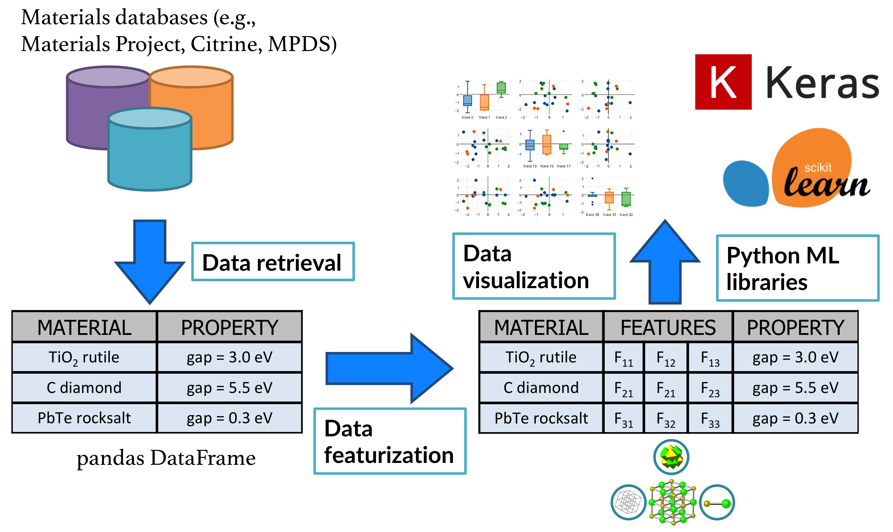

.. title:: matminer (Materials Data Mining)

========
matminer
========

matminer is a Python library for data mining the properties of materials.

Matminer contains routines for:

- **one-line access to 40+ ready-made datasets** (:code:`matminer.datasets`)
    - Spans various domains of materials data
    - Full list of datasets here: :doc:`Table of Datasets </dataset_summary>`
- **easily creating your own datasets from online repositories**  (:code:`matminer.data_retrieval`)
    - such as `The Materials Project <https://materialsproject.org>`_ and `Citrination <https://citrination.com>`_, among others
- **transforming and featurizing complex materials attributes into numerical descriptors**  (:code:`matminer.featurizers`)
    - 70+ featurizers adapted from scientific publications
    - Feature generation routines for
        - chemical compositions
        - crystal sites and structures
        - electronic bandstructure/DOS
        - function-expansions of features
    - **tools and utilities for practically handling materials data**, in dataframe format (:code:`matminer.featurizers.conversions`)
    - Full table of featurizers here: :doc:`Table of Featurizers. </featurizer_summary>`
- **one-line access to pre-trained deep learning models** for inference (:code:`matminer.models` - Coming soon!)

Matminer does not contain machine learning routines itself, but works with the `pandas <https://pandas.pydata.org>`_ data format in order to make various downstream machine learning libraries and tools available to materials science applications.

matminer is `open source <https://github.com/hackingmaterials/matminer>`_ via a BSD-style license.

A general workflow and overview of matminer's capabilities is presented below:

|

|
|

Take a tour of matminer's features by scrolling down!

Related software
________________

- `matminer_examples <https://github.com/hackingmaterials/matminer_examples>`_ is a repository of example notebooks showing how to use matminer.
- `automatminer <https://github.com/hackingmaterials/automatminer>`_ is the automatic version of matminer, which automatically fits a machine learning pipeline to your problem using matminer descriptors.
- `figrecipes <https://github.com/hackingmaterials/figrecipes>`_ is a Plotly-based code for quickly generating interactive plots from dataframes
- `matbench <https://github.com/hackingmaterials/matbench>`_ is an ImageNet for materials properties - a reproducible benchmarking package and dynamic leaderboard for comparing ML algorithms

Quick Links
___________

* :doc:`Table of Datasets </dataset_summary>`
* :doc:`Table of Featurizers </featurizer_summary>`

Autogenerated code documentation:

* :ref:`genindex`
* :ref:`modindex`
* :ref:`search`

Installation
___________________

To install matminer, follow the short :doc:`installation tutorial. </installation>`

Overview
_________

----------------------------------------------
Featurizers generate descriptors for materials
----------------------------------------------

Matminer can turn materials objects - for example, a composition such as "Fe3O4" - into arrays of numbers representing things like average electronegativity or
difference in ionic radii of the substituent elements. Matminer also contains sophisticated crystal structure and site featurizers (e.g.,
obtaining the coordination number or local environment of atoms in the structure) as well as featurizers for complex materials data such as
band structures and density of states.

All of these various featurizers are available under **a consistent interface**, making it easy to
try different types of materials descriptors for an analysis and to transform materials science objects into physically-relevant numbers for data
mining. A full :doc:`Table of Featurizers</featurizer_summary>` is available.

.. image:: _static/featurizer_diagram.png
   :align: center
   :width: 1000px
   :alt: Diagram of featurizers

----------------------------------------------------------------------
Data retrieval easily puts complex online data into dataframes
----------------------------------------------------------------------

**Retrieve data from the biggest materials databases, such as the Materials Project and Citrine's databases, in a Pandas dataframe format**

The `MPDataRetrieval <https://github.com/hackingmaterials/matminer/blob/master/matminer/data_retrieval/retrieve_MP.py>`_ and `CitrineDataRetrieval <https://github.com/hackingmaterials/matminer/blob/master/matminer/data_retrieval/retrieve_Citrine.py>`_ classes can be used to retrieve data from the biggest open-source materials database collections of the `Materials Project <https://www.materialsproject.org/>`_ and `Citrine Informatics <https://citrination.com/>`_, respectively, in a `Pandas <http://pandas.pydata.org/>`_ dataframe format. The data contained in these databases are a variety of material properties, obtained in-house or from other external databases, that are either calculated, measured from experiments, or learned from trained algorithms. The :code:`get_dataframe` method of these classes executes the data retrieval by searching the respective database using user-specified filters, such as compound/material, property type, etc , extracting the selected data in a JSON/dictionary format through the API, parsing it and output the result to a Pandas dataframe with columns as properties/features measured or calculated and rows as data points.

For example, to compare experimental and computed band gaps of Si, one can employ the following lines of code:

.. code-block:: python

   from matminer.data_retrieval.retrieve_Citrine import CitrineDataRetrieval
   from matminer.data_retrieval.retrieve_MP import MPDataRetrieval

   df_citrine = CitrineDataRetrieval().get_dataframe(criteria='Si', properties=['band_gap'])
   df_mp = MPDataRetrieval().get_dataframe(criteria='Si', properties=['band_gap'])

`MongoDataRetrieval <https://github.com/hackingmaterials/matminer/blob/master/matminer/data_retrieval/retrieve_MongoDB.py>`_ is another data retrieval tool developed that allows for the parsing of any `MongoDB <https://www.mongodb.com/>`_ collection (which follows a flexible JSON schema), into a Pandas dataframe that has a format similar to the output dataframe from the above data retrieval tools. The arguments of the :code:`get_dataframe` method allow to utilize MongoDB's rich and powerful query/aggregation syntax structure. More information on customization of queries can be found in the `MongoDB documentation <https://docs.mongodb.com/manual/>`_.

--------------------------------------
Access ready-made datasets in one line
--------------------------------------

**Explore datasets for analysis, benchmarking, and testing without ever leaving the Python interpreter**

The datasets module provides an ever growing collection of materials science datasets that have been collected, formatted as pandas dataframes, and made available through a unified interface.

Loading a dataset as a pandas dataframe is as simple as:

.. code-block:: python

    from matminer.datasets import load_dataset

    df = load_dataset("jarvis_dft_3d")

Or use the dataset specific convenience loader to access operations common to that dataset:

.. code-block:: python

    from matminer.datasets.convenience_loaders import load_jarvis_dft_3d

    df = load_jarvis_dft_3d(drop_nan_columns=["bulk modulus"])

Matminer's consistently-formatted datasets makes analysis, visualization, and prototyping models quick and easy:

.. code-block:: python

   from figrecipes import PlotlyFig
   from matminer.datasets import load_dataset
   df = load_dataset("elastic_tensor_2015")
   pf = PlotlyFig(df, y_title='Bulk Modulus (GPa)', x_title='Shear Modulus (GPa)', filename='bulk_shear_moduli')
   pf.xy(('G_VRH', 'K_VRH'), labels='material_id', colors='poisson_ratio', colorscale='Picnic', limits={'x': (0, 300)})

.. raw:: html

    <iframe src="_static/bulk_shear_moduli.html" height="1000px" width=90%" align="center" frameBorder="0">Browser not compatible.</iframe>

See :doc:`the dataset summary page </dataset_summary>` for a comprehensive summary of
datasets available within matminer. If you would like to contribute a dataset to matminer's
repository see :doc:`the dataset addition guide </dataset_addition_guide>`.

-----------------------------------------------
Data munging with Conversion Featurizers
-----------------------------------------------

Matminer's multiprocessing-parallelized and error-tolerant featurizer structure makes transforming materials objects into other formats quick and easy.

For example, here is code that robustly transforms a dataframe of 10k ASE (atomic simulation environment) structures in the "ase atoms" column - some of which contain errors - to Pymatgen structures to use with matminer:

.. code-block:: python

    from matminer.featurizer.conversions import ASEAtomstoStructure

    aa2s = ASEAtomstoStructure()

    df = aa2s.featurize_dataframe(df, "ase atoms", ignore_errors=True)

.. code-block:: text

                                                   ase atoms                        pymatgen structure from ase  log10(K_VRH)
    0      (Atom('Ca', [0.0, 0.0, 0.0], index=0), Atom('G...  [[0. 0. 0.] Ca, [1.37728887 1.57871271 3.73949...      1.707570
    1      Atoms(symbols='CO', pbc=False)                     NaN                                                    -inf
    2      (Atom('Si', [2.068845188153371, 2.406272406310...  [[ 2.06884519  2.40627241 -0.45891585] Si, [1....      1.908485
    3      (Atom('Pd', [2.064280815, 0.0, 2.064280815], i...  [[2.06428082 0.         2.06428082] Pd, [0.   ...      2.117271
    4      (Atom('Mg', [3.0963526175, 1.0689416025, 1.536...  [[3.09635262 1.0689416  1.53602403] Mg, [0.593...      1.690196
                                                      ...                                                ...           ...
    10982  Atoms('N3', [(0, 0, 0), (1, 0, 0), (0, 0, 1)])     NaN                                                    -inf
    10983  (Atom('Mg', [-1.5115782146589711, 4.4173924989...  [[-1.51157821  4.4173925   1.21553922] Mg, [3....      1.724276
    10984  (Atom('H', [4.375467717853649, 4.5112839336581...  [[4.37546772 4.51128393 6.81784473] H, [0.4573...      1.342423
    10985  (Atom('Si', [0.0, 0.0, 0.0], index=0), Atom('S...  [[0. 0. 0.] Si, [ 4.55195829  4.55195829 -4.55...      1.770852
    10986  (Atom('Al', [1.44565668, 0.0, 2.05259079], ind...  [[1.44565668 0.         2.05259079] Al, [1.445...      1.954243

Other matminer ConversionFeaturizers include:

- Adding oxidation states to pymatgen structures and compositions
- converting to/from Composition object/string representations of composition
- converting objects to/from json representation
- Accessing arbitrary methods and attributes of pymatgen classes with :code:`PymatgenFunctionApplicator`

Examples
________

Check out some examples of how to use matminer!

0. Examples index. (`Jupyter Notebook <https://nbviewer.jupyter.org/github/hackingmaterials/matminer_examples/blob/main/matminer_examples/index.ipynb>`_)

1. Use matminer and scikit-learn to create a model that predicts bulk modulus of materials. (`Jupyter Notebook <https://nbviewer.jupyter.org/github/hackingmaterials/matminer_examples/blob/main/matminer_examples/machine_learning-nb/bulk_modulus.ipynb>`_)

2. Compare and plot experimentally band gaps from Citrine with computed values from the Materials Project (`Jupyter Notebook <https://nbviewer.jupyter.org/github/hackingmaterials/matminer_examples/blob/main/matminer_examples/data_retrieval-nb/expt_vs_comp_bandgap.ipynb>`_)

3. Compare and plot U-O bond lengths in various compounds from the MPDS (`Jupyter Notebook <https://nbviewer.jupyter.org/github/hackingmaterials/matminer_examples/blob/main/matminer_examples/data_retrieval-nb/mpds.ipynb>`_)

4. Retrieve data from various online materials repositories (`Jupyter Notebook <https://nbviewer.jupyter.org/github/hackingmaterials/matminer_examples/blob/main/matminer_examples/data_retrieval-nb/data_retrieval_basics.ipynb>`_)

5. Basic Visualization using FigRecipes (`Jupyter Notebook <https://nbviewer.jupyter.org/github/hackingmaterials/matminer_examples/blob/main/matminer_examples/figrecipes-nb/figrecipes_basics.ipynb>`_)

6. Advanced Visualization (`Jupyter Notebook <https://nbviewer.jupyter.org/github/hackingmaterials/matminer_examples/blob/main/matminer_examples/figrecipes-nb/figrecipes_advanced.ipynb>`_)

7. Many more examples! See the `matminer_examples <https://github.com/hackingmaterials/matminer_examples>`_ repo for details.

Citations and Changelog
_______________________

---------------
Citing matminer
---------------

If you find matminer useful, please encourage its development by citing the following paper in your research

.. code-block:: text

   Ward, L., Dunn, A., Faghaninia, A., Zimmermann, N. E. R., Bajaj, S., Wang, Q.,
   Montoya, J. H., Chen, J., Bystrom, K., Dylla, M., Chard, K., Asta, M., Persson,
   K., Snyder, G. J., Foster, I., Jain, A., Matminer: An open source toolkit for
   materials data mining. Comput. Mater. Sci. 152, 60-69 (2018).

Matminer helps users apply methods and data sets developed by the community. Please also cite the original sources, as this will add clarity to your article and credit the original authors:

* If you use one or more **data retrieval methods**, use the ``citations()`` method present for every data_retrieval class in matminer. This function will provide a list of BibTeX-formatted citations for that featurizer, making it easy to keep track of and cite the original publications.
* If you use one or more **featurizers**, please take advantage of the ``citations()`` method present for every featurizer in matminer.
* If you use one or more **datasets**, please check the metadata of the dataset for a comprehensive list of BibTex formatted citations to use.

---------
Changelog
---------

Check out our full changelog :doc:`here. </changelog>`

-------------------------
Contributions and Support
-------------------------
Want to see something added or changed? Here's a few ways you can!

* Help us improve the documentation. Tell us where you got 'stuck' and improve the install process for everyone.
* Let us know about areas of the code that are difficult to understand or use.
* Contribute code! Fork our `Github repo <https://github.com/hackingmaterials/matminer>`_ and make a pull request.

Submit all questions and contact to the `Discourse forum <https://discuss.matsci.org/c/matminer>`_

A comprehensive guide to contributions can be found `here. <https://github.com/hackingmaterials/matminer/blob/master/CONTRIBUTING.md>`_

A full list of contributors can be found :doc:`here. </contributors>`

